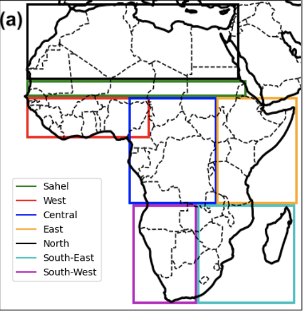
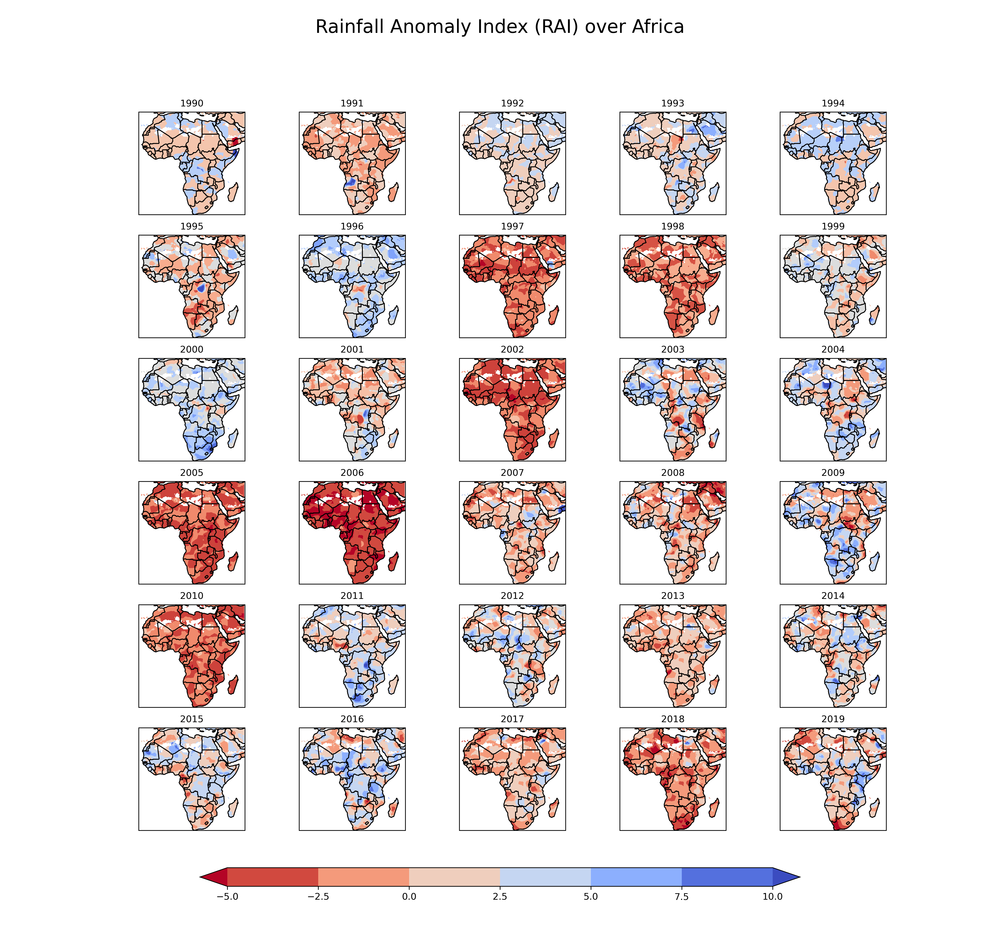

# Assessing Rainfall Variability and ENSO Influence on African Precipitation

by: Daniel A. Adjei
---

Introduction
---

The variability of rainfall exhibited on both spatial and temporal scales (Ball et al., 2019) is of interest to farmers and water resource managers in Africa. As the most discriminant climatic parameter in the tropics, rainfall is used in determining climatic changes in a geographical area by determining long time series in precipitation variability (Sadiq et al., 2020). Many studies over the years have employed various approaches in estimating rainfall variability including the use of the Rainfall Anomaly Index, a method known for its unique ability in describing drought incidence in the African Sahel since the end of the 1960s. Developed by Van Rooy (1965), RAI employs a ranking procedure to assign magnitudes of positive and negative precipitation anomalies (Keyantash and Dracup, 2002), making use of a simple normalization procedure. While precipitation in Africa is known to be driven by local-scale phenomena, including the monsoonal flow associated with the movement of the Intertropical Convergence Zone (ITCZ), global-scale phenomena such as the El-Niño Southern Oscillation (ENSO), a quasi-periodic warming of the sea surface waters in the central and eastern tropical Pacific Ocean influence precipitation in Africa. In this study, the variability of rainfall in Africa will be assessed in addition to investigating the impact of the ñino3.4 index on the rainfall. Analysis conducted in the study include but not limited to monthly averaged precipitation climatology, annual averaged precipitation climatology spanning the temporal domain (1990-2019), anomaly computation and composites.

Study Area
---
Africa is loacted between latitudes...

[Link to image source](https://doi.org/10.1002/wea.7633)

Data
---

The dataset used in this project:

### Cru TS Precipitation Dataset 

The Climate Research Unit Time Series (CRU TS) dataset is a gridded dataset with a spatial resolution of 0.5 by 0.5 degree based on a spatially complete analysis of records of more than 4000 individual weather stations. Variables included in this dataset are monthly fields of precipitation, daily maximum and minimum temperatures, and cloud cover for 1901-2022. In this report, the monthly precipitation variable is used to compute the monthly and annual average climatology and the annual anomaly. 

[Link to dataset description](https://climatedataguide.ucar.edu/climate-data/cru-ts-gridded-precipitation-and-other-meteorological-variables-1901)

Method
---
### Rainfall Anomaly Index (RAI)

The Rainfall Anomaly Index (RAI), developed by Rooy (1965) , is used to classify the positive and negative severities in rainfall anomalies. It is considered an index of remarkable procedural simplicity because it requires only precipitation data ( Freitas, 2005 ; Fernandes et al., 2009 ). According to Rooy (1965) , RAI aims to make the comparison between precipitation deviations in different regions feasible.

Where:

$\overline{N}$ is the average monthly/seasonal/annual precipitation of historical series;

$\overline{M}$ is the average of ten highest monthly/seasonal/annual precipitations;

$\overline{X}$ is the average of ten lowest monthly/seasonal/annual precipitations;

N − $\overline{N}$ represents the positive anomaly and negative anomaly based on positive or negative values.

Any change???

### El Niño Southern Oscillation (Niño3.4) Index 

Monthly mean sea surface temperature dataset computed as the Niño3.4 index, spanning 1990 to 2019, is used to calculate composites for El-Niño, La Nina, and Neutral phases, evaluating the impact of each phase on precipitation in Africa. 

[Link to NCAR niño indices description](https://climatedataguide.ucar.edu/climate-data/nino-sst-indices-nino-12-3-34-4-oni-and-tni)

Results and Analysis
---

### Project Notebook on Github

A collection of jupyter notebooks used for this analysis can be be found in my CLIM680-Report directory via [Analysis:](https://github.com/DannyActive/CLIM680-Report) . The python notebook [RAI](https://github.com/DannyActive/CLIM680-Report/blob/main/RAI.ipynb) includes a manual function for computing the Rainfall Anomaly Index (RAI). All notebooks are labeled and commented.

### Conda environment 
The [climate.yml](climate.yml) file provides the conda environment for the successful execution of codes used in this study.

### Figures
All figures generated from this work can be found in the sub-repository [figures](https://github.com/DannyActive/CLIM680-Report/tree/main/figures).
The figures from my project notebook are saved in a seperate 'figures' subdirectory, as well as shown in the project notebook.

### Climatology and Anomalies 

To observe the seasonal variation of precipitation in Africa, the seasonal precipitation climatology is computed over the 30-yeaar duration. The northern, sahelian, and West African regions experience less precipitaipn during DJF (December, January, February), the season known as the harmattan characterized by the intruition of warm, dry and dusty winds from the the Saharan desert. During the DJF seasson, central, and southern Africa experience significant amount of rainfall.   

A panel plot of the climatology of monthly averaged precipitation (in meters), monthly averaged cloud cover, and monthly averaged precipitable water (in kg/m^2) was plotted for each month, in order to observe differences in the monthly/seasonal cycle, and spatial variability. The largest amount of cloud cover is located around 0-20S in DJF (December, Janurary, February), gradually shifting north by MAM (March, April, May), and then furthest north in a band between 5S-15N by the JJA (June, July, August) rainy season. Precipitable water shows similar patterns, with highest values concentrated near the Gulf of Ginuea. The precipitation climatology, which is plotted in powers of 2 to highlight nonlinearity, also shows this northward shift in the rainy season.

Describe the Annual Climatology plot...

Drag and Drop

Here's for the annual RAI variability

here's for Composite difference during ENSO

.png)

Here's for composiste precip anomaly...

.png)

Here's for diff Nino-neutral

.png)

Reference
---

