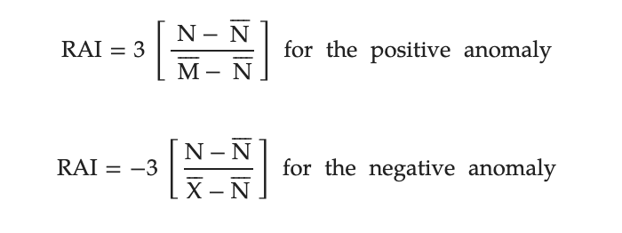
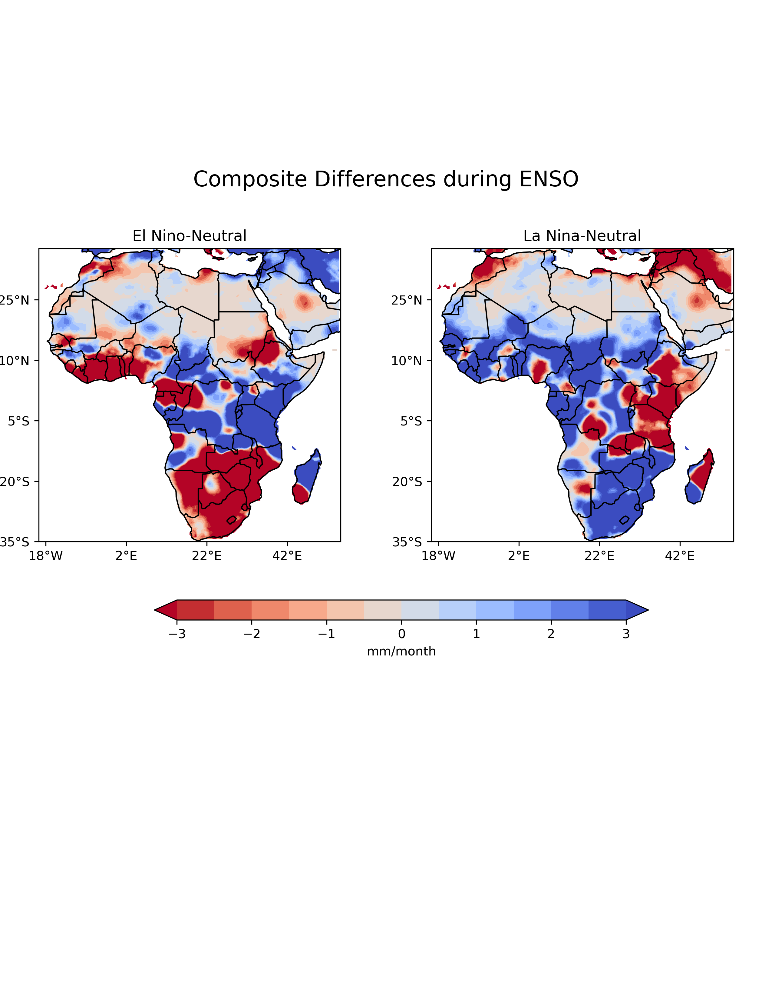
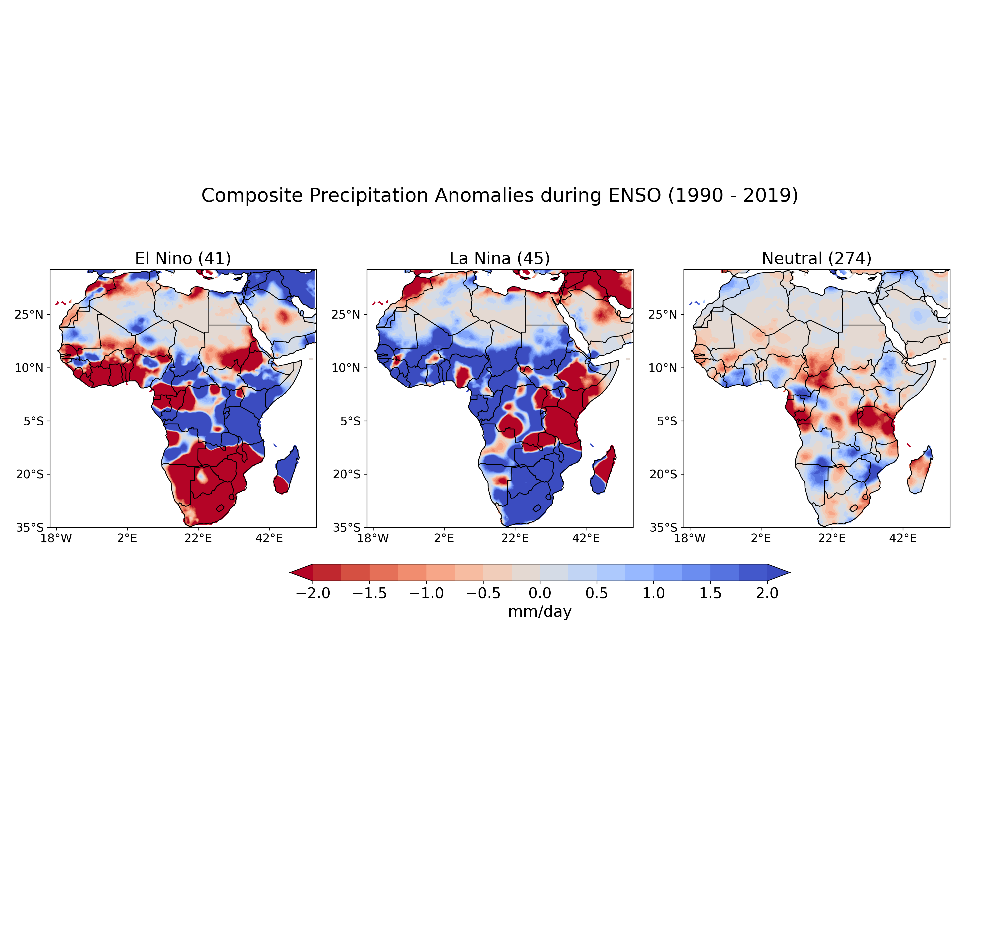

# Historical Assessment of ENSO Influence on Rainfall Variability in Africa

By: Daniel A. Adjei
---

Introduction
---

The variability of rainfall exhibited on both spatial and temporal scales (Ball et al., 2019) is of interest to farmers and water resource managers in Africa. As the most discriminant climatic parameter in the tropics, rainfall is used in determining climatic changes in a geographical area by determining long time series in precipitation variability (Sadiq et al., 2020). Many studies over the years have employed various approaches in estimating rainfall variability including the use of the Rainfall Anomaly Index, a method known for its unique ability in describing drought incidence in the African Sahel since the end of the 1960s. Developed by Van Rooy (1965), RAI employs a ranking procedure to assign magnitudes of positive and negative precipitation anomalies (Keyantash and Dracup, 2002), making use of a simple normalization procedure. While precipitation in Africa is known to be driven by local-scale phenomena, including the monsoonal flow associated with the movement of the Intertropical Convergence Zone (ITCZ), global-scale phenomena such as the El-Niño Southern Oscillation (ENSO), a quasi-periodic warming of the sea surface waters in the central and eastern tropical Pacific Ocean influence precipitation in Africa. In this study, the variability of rainfall in Africa will be assessed in addition to investigating the impact of the ñino3.4 index on the rainfall. Analysis conducted in the study include but not limited to monthly averaged precipitation climatology, annual averaged precipitation climatology spanning the temporal domain (1990-2019), anomaly computation and composites.

Study Area
---
With longitudinal boundaries of -25 degrees, 64 degrees and latitudinal boundaries of -35 degrees and 37.3 degrees, Africa is characterized by different climatic regions. The ecosystem in each climatic region adapts to the prevailing climatic conditions. In this study, the continent is demarcated into 7 zones adopted from Aryee et al 2024. The zones are West Africa(West), Sahel, East Africa(East), Central Africa (Central),South-western Africa (South-West), South-eastern Africa (South-East) and Northern Africa (North). Precipitation in Africa is influenced by the monsoon system.

[Link to image source](https://doi.org/10.1002/wea.7633)

Data
---

The dataset used in this project:

### Cru TS Precipitation Dataset 

The data used in this study was retrieved from the Climate Research Unit Time Series version4.05 **(CRU TS4.05)** produced by the University of East Anglia **(UEA)**. The data is a gridded dataset with a spatial resolution of 0.5 by 0.5 degree based on a spatially complete analysis of records of more than 4000 individual weather stations. Variables included in this dataset are monthly fields of precipitation, daily maximum and minimum temperatures, and cloud cover for 1901-2022. In this report, the monthly precipitation variable is used to compute the seasonal and annual average climatology and the annual anomaly from 1990 to 2019. The data can be accesed via via [CRU](https://eartharxiv.org/repository/view/6511/).

[Link to dataset description](https://climatedataguide.ucar.edu/climate-data/cru-ts-gridded-precipitation-and-other-meteorological-variables-1901)

Method
---
### Rainfall Anomaly Index (RAI)

The Rainfall Anomaly Index (RAI), developed by Rooy (1965) , is used to classify the positive and negative severities in rainfall anomalies. It is considered an index of remarkable procedural simplicity because it requires only precipitation data ( Freitas, 2005). RAI provides a feassible means of comparing precipitation deviations (Rooy 1965). In this index, the precipitation values for the study period are ranked in descending order of magnitude. The average of the ten highest precipitation values as well the the values of the ten lowest precipitation values are computed. The positive and regative RAI indeces are computed using the mean of the ten highest and lowest extremes respectively. 

Where:

N
 is the average monthly/seasonal/annual precipitation of historical series;

M
 is the average of ten highest monthly/seasonal/annual precipitations;

X
 is the average of ten lowest monthly/seasonal/annual precipitations;

N − N
 represents the positive anomaly and negative anomaly based on positive or negative values.

### El Niño Southern Oscillation (Niño3.4) Index 

Monthly mean sea surface temperature dataset computed as the Niño3.4 index, spanning 1990 to 2019, is used to calculate composites for El-Niño, La Nina, and Neutral phases, evaluating the impact of each phase on precipitation in Africa. 

[Link to NCAR niño indices description](https://climatedataguide.ucar.edu/climate-data/nino-sst-indices-nino-12-3-34-4-oni-and-tni)

Results and Analysis
---

### Project Notebook on Github

A collection of jupyter notebooks used for this analysis can be be found in my CLIM680-Report directory via [Analysis:](https://github.com/DannyActive/CLIM680-Report) . The python notebook [RAI](./RAI.ipynb) includes a manual function for computing the Rainfall Anomaly Index (RAI). All notebooks are labeled and commented.

### Conda environment 
The [climate.yml](./climate.yml) file provides the conda environment for the successful execution of codes used in this study.

### Figures
All figures generated from this work can be found in the sub-repository [figures](https://github.com/DannyActive/CLIM680-Report/tree/main/figures).
The figures from my project notebook are saved in a seperate 'figures' subdirectory, as well as shown in the project notebook.

### Climatology and Anomalies 

To observe the seasonal variation of precipitation in Africa, the seasonal precipitation climatology is computed over the 30-yeaar duration, producing a panel plot. North Africa experiences the least amount amount of rainfall throughout all seeasons. West and the upper central Africa experiences the highest rainfall amount in during JJA (June, July, August). The rainfall pattern subsequently shifts towards the south during MAM (March April, May), providing high rainfall amounts to  Central, East and South Africa. High rainfall amounts are recorded along the coasts of Central and West Coasts of West Africa during MAM (March, April, May) The minmal rainfall recorded in the north, sahel, and West Africa regions during DJF (December, January, February), is caused by the intruition of warm, dry and dusty winds from the the Saharan desert, producing the harmattan.

Varying rainfall amounts across the various regions of Africa is influenced by by factors including topography and vegetation. Results from this analysis shows a general decline in rainfall amounts in Africa, with the north Africa recording the leaat amount of precipitation. This can be attributed to the extend of travel of the Intertropical Convergence Zone (ITCZ) to the north, a key feature that drives precipitation in West and north Africa. East Africa's decline in long rains during MAM of 2010 and 2011 (William et al., 2011) caused a widespread famine in the Horn of Africa (United Nations Office for the Coordination of Humanitarian Affairs, 2011).    

Precipitation anomalies over the years have been variable. Significant negative anomalies over the study area were recorded in the years 1997, 1998, 2002, 2005, 2006 and 2010 with values less than -5. While a low anomaly was recorded in 2018, signifcant negative values were recorded in South Africa, upper Central Africa. 1996 and 2000 recorded positive anomalies.

### ENSO and Precipitation in Africa

This section of the study is to investigate the impact of ENSO on precipitation in Africa.

### Composite and mean differences with Niñ0 3.4

In this section of the study, composite analysis is performed on precipitation in Africa with the niño 3.4 index. Warm, neutral and cold events are grouped as a Sea Surface Temperature Anomaly (SSTA), where warm (el nino), neutral and cold (la nina) is &ge; 1 (greater than or qual to 1), 0 and &le; -1 (less than or equal to 1) repectively. Exclusive calculation of the climatology and anomaly is done for the precipitation data and the dates in the preipitation data that match el nino, neutral and la nina phases were selected. The precipitation anomalies from this subset was used in generating composite precipitation anomaly plots during ENSO phases. Results from the plots show negative preipitation anomalies in south and west Africa during and positive anomaly in east Africa during EL Niño months. A reversse pattern is sseen during a la niña years where a negative anomaly is recorded in east Africa and a positive precipitation anomaly in south and west Africa. Most months within the the duration of study were within the neutral phase of ENSO with the coasts of central and easst Africa recording negative precipitation anomalies. The mean precipitation composite difference between El Niño and neutral phase was visualized, hatching off areas with statistical significance ussing the 95th confidence interval.

.png)

Summary
---
The African continent has experienced a decline in preipitation indicated by negative rainfall anomaly in most zones as demarcated in the study. ENSO influences precipitaion patterns in Africa through its interaction with the monsoon system that drive precipitation. Future studies will investigate the impact of ENSO on the pattern of individual monsoon systems that drive precipitation in each climatic zone of Africa.

Reference
---
Apriliyati, D., & Pasan, E. (2024). The United Nations Office for the Coordination of Humanitarian Affairs (OCHA) Humanitarian Response Plan in Handling the Afghanistan Food Crisis. Papua Journal of Diplomacy and International Relations, 4(1), 29-48.

Ball, J. E., Babister, M. K., Nathan, R., Weinmann, P. E., Weeks, W., Retallick, M., & Testoni, I. (2016). Australian Rainfall and Runoff-A guide to flood estimation.

De Sousa Freitas, MA (1998). A decision support system for monitoring meteorological droughts in semi-arid regions. Revista Tecnologia , 19 (1).

Keyantash, J., & Dracup, J. A. (2002). The quantification of drought: an evaluation of drought indices. Bulletin of the American Meteorological Society, 83(8), 1167-1180.

Sadiq, A. A., Umar, S. M., & Bello, M. U. (2020). An estimation of rainfall anomaly index and its impact on crop production in Yola and environs. African Journal of Environment and Natural Science Research, 3(4), 35-53.

Williams, A. P., Funk, C., Michaelsen, J., Rauscher, S. A., Robertson, I., Wils, T. H., ... & Loader, N. J. (2012). Recent summer precipitation trends in the Greater Horn of Africa and the emerging role of Indian Ocean sea surface temperature. Climate dynamics, 39, 2307-2328.

Van Rooy, C. A. (1965). Studies in classical satire and related literary theory. Brill Archive.

